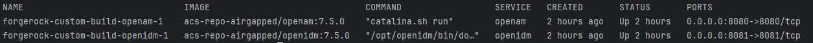

# Docker Environment for ForgeRock OpenAM and OpenIDM

Welcome to the Dockerized environment setup for ForgeRock **OpenAM** and **OpenIDM**. This README provides an overview of Docker Compose, the scripts for managing Docker images, and the specific versions of the software being used.

---

## What is Docker Compose?

**Docker Compose** is a tool for defining and running multi-container Docker applications. With Docker Compose, you can:

- **Define** your app's services, networks, and volumes in a single `docker-compose.yml` file.
- **Run** all services with a single command.
- **Manage** lifecycle commands (start, stop, restart) easily.

Docker Compose simplifies the management of complex applications by allowing you to handle multiple containers as a single unit.

---

## Scripts Overview

###  **Loading and Saving Docker Images**

We have provided two essential scripts for managing Docker images:

#### **Saving Script: `build_and_save_docker_images.sh`**

- **Purpose**: Builds Docker images from specified directories and saves them as `.tar` files.
- **Key Features**:
    - Iterates over directories containing Dockerfiles.
    - Builds images and saves them to a specified output directory.
    - Supports verbose output for debugging.

#### **Loading Script: `load_docker_images.sh`**

- **Purpose**: Loads previously saved Docker images from `.tar` files into your Docker environment.
- **Key Features**:
    - Checks for the existence of the specified input directory.
    - Loops through all `.tar` files to load each one.
    - Outputs success or failure messages for each operation.
    - Supports a verbose flag for detailed logging.

---

## Software Versions

This project uses the following software versions:

- **OpenJDK**: `17`
- **OpenAM**: `7.5.0`
- **OpenIDM**: `7.5.0`

These versions ensure compatibility and feature support for the identity and access management functionalities provided by OpenAM and OpenIDM.

---

## Standard Operating Procedure (SOP)

## Docker Environment Setup Steps

To get the environment up and running, follow these steps:

### 1. Run the Load Script

Execute the loading script to import the saved Docker images.

```bash
./load_and_push_docker_images.sh
```
*(Refer to the [Loading Script section](#loading-script-load_docker_imagessh) for more details¹.)*

### Start ForgeRock Services
**Start the Services**: Use the start service script to run two of the Docker images defined in your `docker-compose.yml`.
```bash 
./start_services.sh
```


### Verify ForgeRock Services 
**Verify the Services**: Check the status of your running services using:
`docker-compose.yml`.
```bash 
docker-compose ps
```
#For example:

